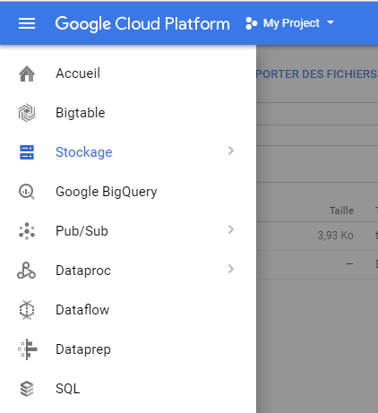

# Test Google Cloud

Il y a plusieurs services qui m'interesse pour le Big Data:

* Google Storage: file system, comme HDFS
* Google Big Query: SQL sur du Big Data, comme Hive
* Google DataProc: Spark as a Service
* Google DataLab: Notebook as a Service

## Google Storage

Facile à manipuler, il suffit de créer des "buckets" et d'y déposer des dossiers/fichiers
