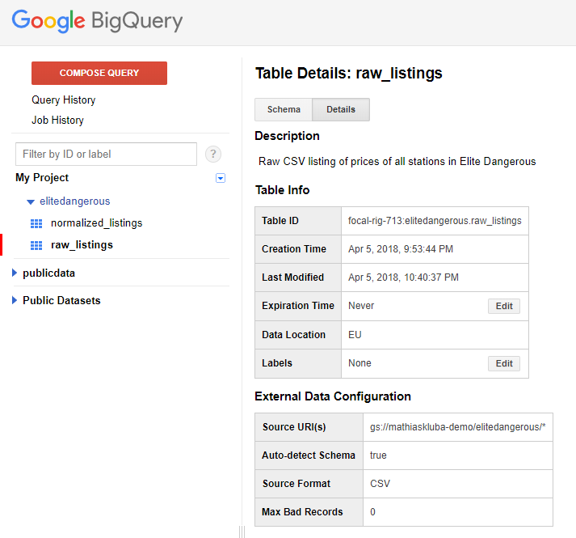

# Test Google Cloud

Il y a plusieurs services qui m'interesse pour le Big Data:

* Google Storage: file system, comme HDFS
* Google Big Query: SQL sur du Big Data, comme Hive
* Google DataProc: Spark as a Service
* Google DataLab: Notebook as a Service

## Google Storage

Facile à manipuler, il suffit de créer des "buckets" et d'y déposer des dossiers/fichiers

J'ai déposé un CSV tout simplement (qui provient de https://eddb.io/api )

## BigQuery

L'IHM est sommaire, mais ça permet de requêter la data en SQL.

On peut créer un "dataset" qui est une sorte de base, et des tables dans le dataset.
On peut créer des tables internes, ou externes. Pour les tables externes ça peut pointer sur Google Storage avec une url gs://bucket/folder/*

J'ai alors fait une table sur le CSV avec détection du schéma, et ça a marché.
A noter qu'on peut faire des tables sur du Avro ou Parquet.

J'ai ensuite fait un "Create Table as Select" pour créer une table interne à partir d'un "select \*" de la table externe.

On peut voir ici les tables/schémas/preview:

On peut faire des requêtes avec réponses imédiate (interactive) ou schédulé dans une file d'attente pour du batch (moins cher).
On a l'historique des requêtes:

On peut faire des UDF en Javascript on dirait...

J'ai ensuite testé MicroStrategy Desktop, qui possède un connecteur natif et qui fonctionne très bien.

Comme l'IHM de BigQuery est pas très sexy, j'ai cherché autre chose et j'ai trouvé https://www.metabase.com/

Ca scan les tables des datasets BigQuery et ça permet de faire des requêtes SQL ou avec un éditeur de query sympa.

Dans la partie d'administration, on peut documenter les tables, les colonnes, ajouter des "segments" (filtre pré-défini pour avoir un sous-ensemble de la table), ajouter des métrics (colonne numérique sur laquel on peut aggréger).

On peut ensuite requêter les données, ou comme ils le disent "poser une question":

On peut afficher le résultat de la question sous forme de table, mais aussi sous forme de graph.

Et si l'éditeur de requête n'est pas suffisant, on peut écrire le SQL directement:

On peut ensuite créer des dashboard à partir de ça (et même rafraichir régulièrement et publier le rapport par email/slack)

## DataLab

## DataProc

